# 🎬 CineManager — Gestor de Películas

Aplicación web desarrollada con Django que permite administrar una colección
de películas y sus directores. Soporta operaciones CRUD completas (Crear, Leer,
Actualizar, Eliminar) para ambas entidades, con una interfaz moderna usando Bootstrap 5.

---

## 🛠️ Tecnologías utilizadas

- Python 3.x
- Django 5.2.13
- Bootstrap 5
- SQLite 

## ⚙️ Pasos para instalación y ejecución
### 1. Clona el repositorio
```bash
git clone https://github.com/bee-17/peliculas
cd peliculas
```
### 2. Crea y activa el entorno virtual
```bash
# Crear entorno virtual
python -m venv venv
# Activar en Windows
venv\Scripts\activate
```
### 3. Instala las dependencias
```bash
pip install django
```
### 4. Aplica las migraciones
```bash
python manage.py makemigrations
python manage.py migrate
```
### 5. Crea un superusuario (para el panel admin)
```bash
python manage.py createsuperuser
```
### 6. Ejecuta el servidor
```bash
python manage.py runserver
```
### 7. Abre la aplicación en tu navegador
```
http://127.0.0.1:8000
```
---

## 📋 Funcionalidades
- ✅ Listar, crear, editar y eliminar **Películas** (Entidad 1)
- ✅ Listar, crear, editar y eliminar **Directores** (Entidad 2)
- ✅ Relación entre Película y Director mediante ForeignKey
- ✅ Interfaz moderna con Bootstrap 5 y tema oscuro

---
## capturas en docs


### 📸 Captura 01 — Entorno virtual activado e instalación de Django
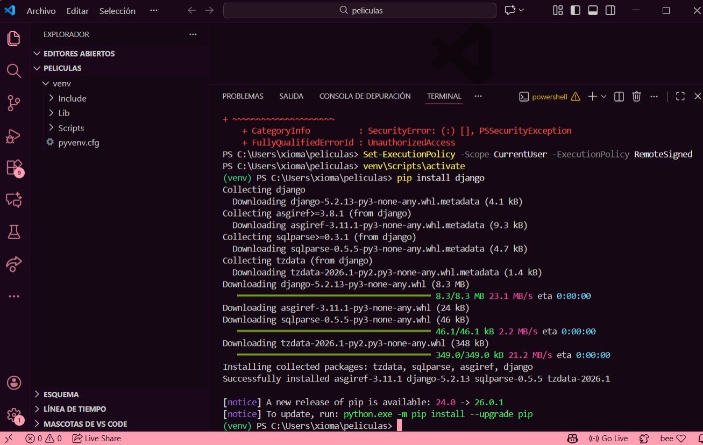

---

### 📸 Captura 02 — Estructura del proyecto en VS Code
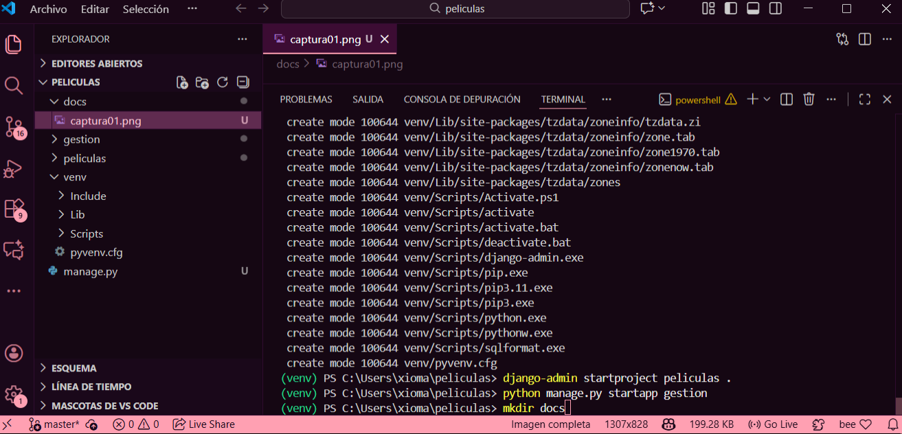

---

### 📸 Captura 03 — Migraciones aplicadas correctamente
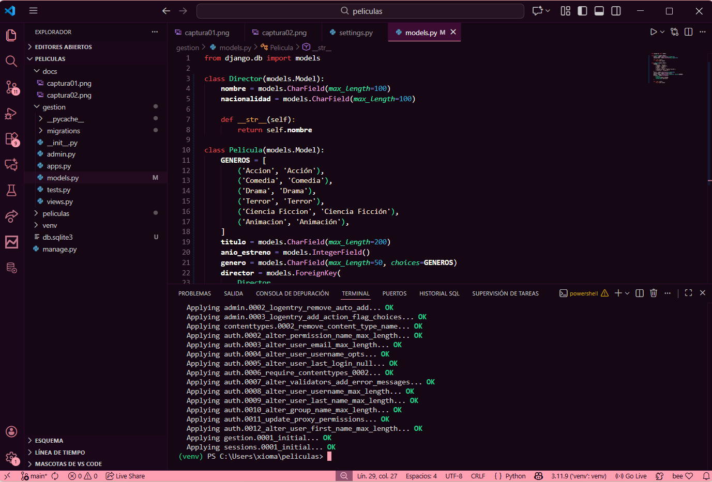

---

### 📸 Captura 04 — Panel de Administración de Django
> Vista de `http://127.0.0.1:8000/admin` 
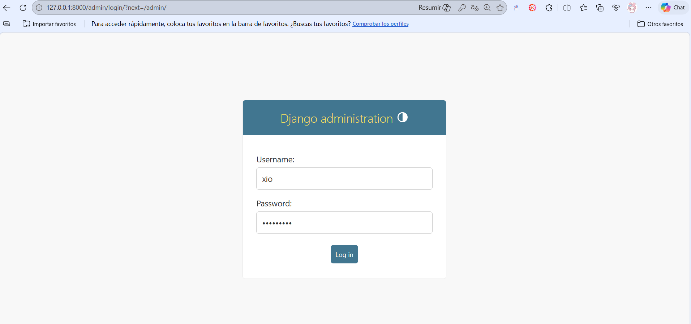

---

### 📸 Captura 05 — Listado de Directores (sin datos)
> Página de directores recién iniciada "No hay directores registrados."
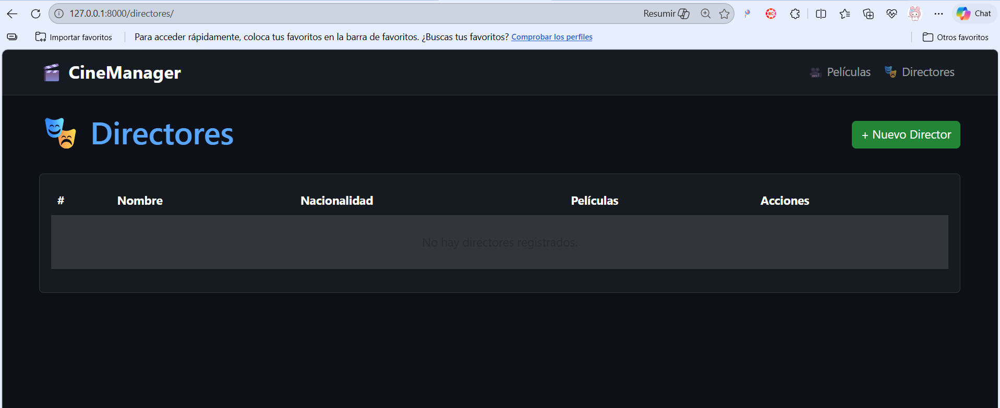

---

### 📸 Captura 06 — Formulario: Crear nuevo Director
> Formulario con los campos Nombre y Nacionalidad listos
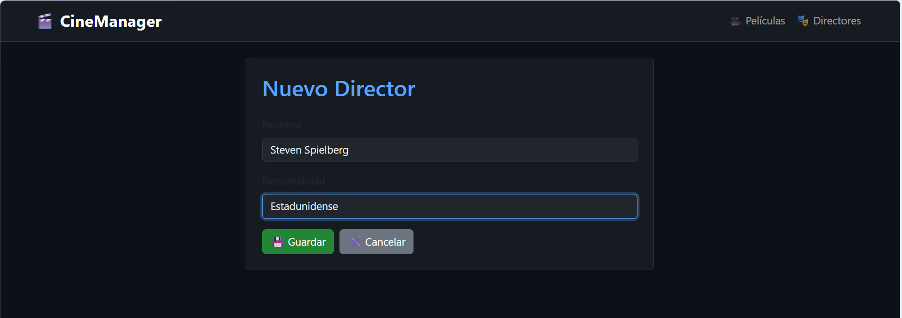

---

### 📸 Captura 07 — Listado de Directores con datos
> Tabla mostrando al menos 2 directores registrados con su nombre,
> nacionalidad y cantidad de películas asociadas.
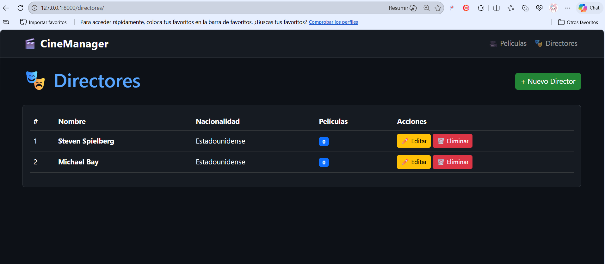

---

### 📸 Captura 08 — Listado de Películas (sin datos)
> Página principal de películas "No hay películas registradas."
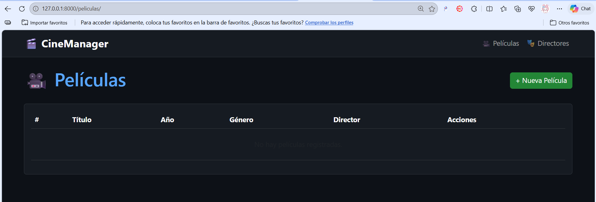

---

### 📸 Captura 09 — Formulario: Crear nueva Película
> Formulario con los campos Título, Año de estreno, Género
> y el selector de Director (relación ForeignKey con Entidad 2).
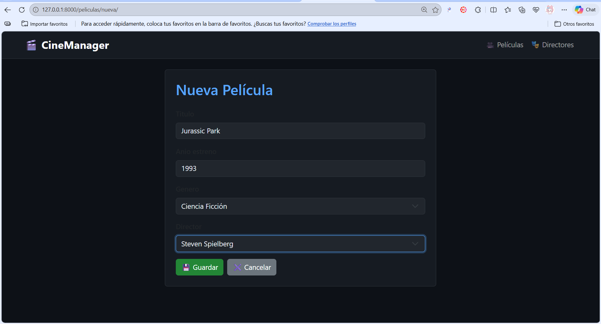

---

### 📸 Captura 10 — Listado de Películas con datos
> Tabla con películas registradas mostrando título,
> año, género y el director relacionado a cada una.
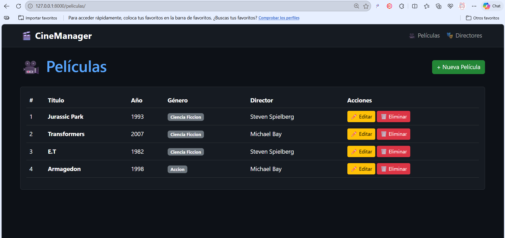

---

### 📸 Captura 11 — Editar una Película existente
> Formulario de edición con los datos de una película 
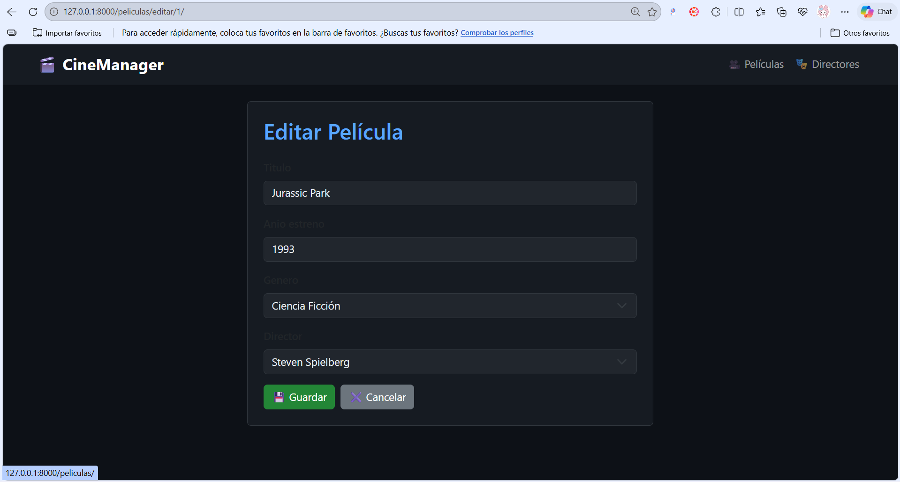

---

### 📸 Captura 12 — Confirmar eliminación de un registro
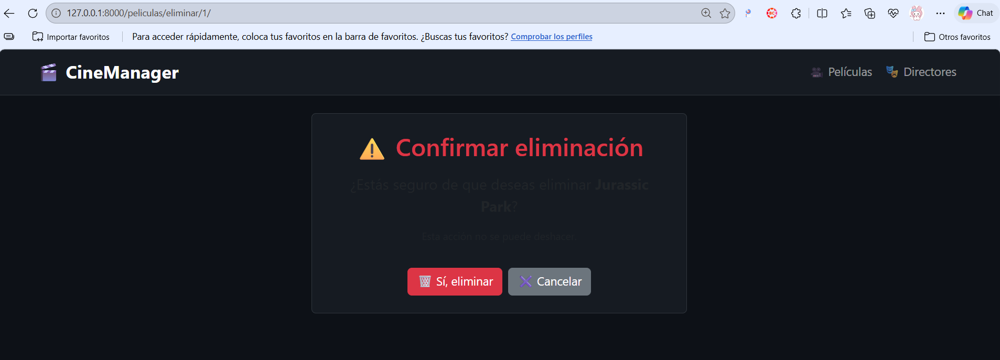

---

### 📸 Captura 13 — Base de datos en el Admin
> Panel de administración mostrando todos los registros guardados en la base de datos.
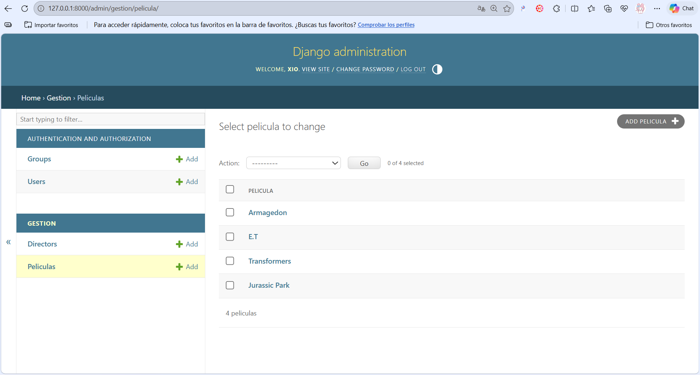

## 🙌 Autor
garcia silva xiomara 